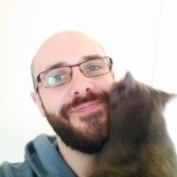

About
=====

My name is Millian Poquet.
I work in the Datamove_ Inria/LIG team in Grenoble, currently as a postdoctoral researcher of the REGALE_ project.
Among other things, I am in charge of the evolution of Batsim_ and of the `datamove-tt seminars`_.

​My work is mostly about distributed systems, especially high performance computing platforms.
I study resource management techniques to exploit these platforms at best,
and I am also interested in studying the applications that run on them.
Software development is a passion for me and I believe that software is now key for research and technologies.
I believe that knowledge should be shared, and most of my experiments and tools are open source.
Reproducibility of scientific experiments is important for me.

I was born in 1991 in the beautiful maritime city of Martigues.
I left the sea to study IT and computer science at Orléans,
where I discovered computer science research thanks to Sébastien Limet and Sophie Robert.
I then moved to Grenoble for my PhD, supervised by Denis Trystram and Pierre-François Dutot in the Datamove team.
I did a postdoc with Martin Quinson in Rennes on the emulation of distributed applications.

.. _REGALE: https://regale-project.eu/
.. _Datamove: https://team.inria.fr/datamove
.. _Batsim: https://batsim.org/
.. _datamove-tt seminars: https://team.inria.fr/datamove/talks/
