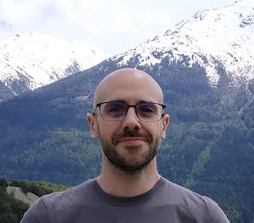

About
=====

Since 2022, I'm an associate professor (Maître de conférences) at `UT`_ (was UT3 Paul Sabatier) and member of the Sepia_ team at IRIT_ (Toulouse, France).

Formerly I was in the Datamove_ Inria_/LIG_ team (Grenoble France), where I worked as a postdoc/research engineer for the REGALE_ and IDIOM projects. That's also where I did my PhD, with Denis Trystram and Pierre-François Dutot.
I did a postdoc with Martin Quinson in Rennes on the emulation of distributed applications.
I discovered computer science research at Orléans thanks to Sébastien Limet and Sophie Robert.

I am mainly interested in experimentation on distributed systems, whether in real life or in simulation.
I sometimes study resource management on these platforms, especially for environmental or sustainability questions.
I believe that tools to build knowledge, publications and all other research artifacts should be shared freely.

.. _UT: https://www.univ-tlse3.fr/
.. _Sepia: https://www.irit.fr/en/departement/dep-architecture-systems-and-networks/sepia-team/
.. _IRIT: https://www.irit.fr/en/home/
.. _Inria: https://www.inria.fr/en
.. _LIG: https://www.liglab.fr/en
.. _REGALE: https://regale-project.eu/
.. _Datamove: https://team.inria.fr/datamove
