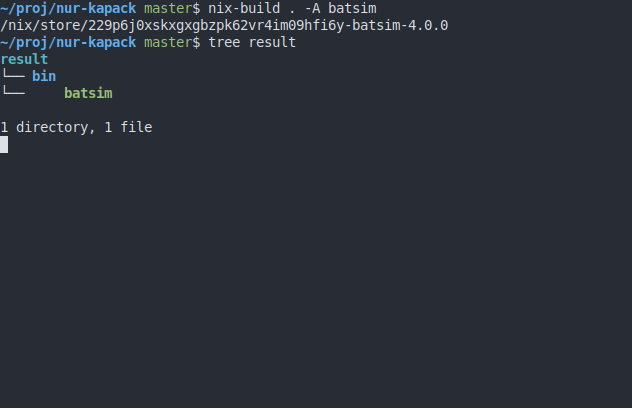
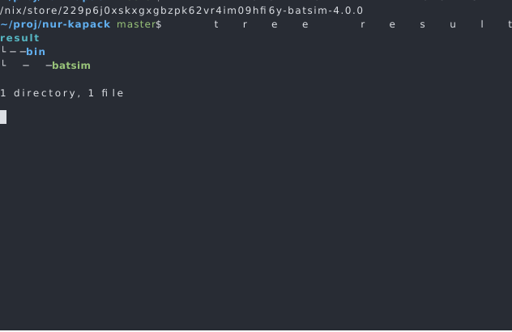
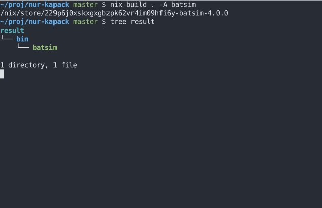

Vectorial screenshots in your slides
====================================

I recently had to put screenshots of my terminal in my slides (PDF generated by Beamer_ via Pandoc_).
While doing a naive screenshot as `raster graphics`_ is fast,
the heavy image size and the impossibility to copy/paste the code I typed in the terminal is a no-go for me.
As I lost a couple of hours and a bit of sanity to find a working combination of tools to generate clean `vector graphics`_ from terminal sessions, I thought it would be interesting to share this in this post.

Recording terminal sessions
---------------------------

The first problem is how to record what you type in a terminal to some file format.
I found two main programs to do this: asciinema_ and termtosvg_.
Both programs are easy-to-use:

1. Open your terminal
2. Run ``asciinema`` or ``termtosvg``, which opens a session (shell) in your terminal
3. Type whatever commands you want — typed commands and printed results are stored
4. Leave the session (Ctrl+D)

asciinema_ is very convenient to use if you want to play your session on a web interface.
They provide a javascript player that can be embedded on your web pages and a free service to host your sessions.
Command-line is well made and you can easily store your session in a JSON file in `asciicast-v2 format`_.
Unfortunately, I could not find usable tools to transform frames of the video into vector graphics.
I found some tools written in javascript (`asciicast-to-svg`_, `svg-term-cli`_) but they were not packaged in Nix_ nor easy to package (I never packaged anything in javascript for now, and staying as far away from js as possible is fine for me :p).
Also, none of these tools seem able to render all useful frames directly as I write these lines.
I do not want a video in my slides, I want to control when to switch from one frame to the next but they took the debatable decision to have a time point as input to decice which frame to export, which would be quite annoying for my use case.

termtosvg_ also has a well made command-line interface.
By default it generates an animated SVG_ file but the ``--still-frames`` (or ``-t``) command-line flag makes it generate one SVG file per useful frame, which matches my use case very well. termtosvg_ has no web embedding, no service to host sessions online and the main developer left the project, but I still chose to use it as it seems to work for my use case. The terminal color theme is easy to customize: I just copied one of the base themes and put colors from `my kitty dark theme`_ in it:

.. literalinclude:: mpoquet.svg
   :language: xml
   :caption: :download:`mpoquet.svg <mpoquet.svg>`

Finally, here is an example usage of termtosvg_ to record a terminal session into images (one SVG per frame into an ``output-frames`` directory), while using my custom theme: ``termtosvg ./output-frames --still-frames -t mpoquet.svg``.
And here is a video of its usage (recorded with asciinema_. Oh, the irony!).

.. raw:: html

    

And here is an example frame as generated by termtosvg_.
Please note that contrary to asciinema, the image renders exactly as in my terminal theme. I also reduced the terminal size contrary to the video example, to avoid small text on a huge empty background (this can be done in termtosvg_ command-line interface, by default it captures the current terminal size).

Converting termtosvg_ SVG to PDF
--------------------------------
I plan to include the terminal images in a Beamer presentation, but SVG is not supported by my usual latex suite. File formats usually chosen for this are postscript and PDF. I chose to use PDF so I need something to convert SVGs to PDFs.

I most of the time use inkscape_ for this, with a command similar to ``inkscape --export-pdf=inkscape-example.pdf termtosvg-example.svg``. Unfortunately, inkscape renders :download:`an ugly mess <inkscape-example.pdf>` instead of a clean screenshot as I write these lines (tested with ``Inkscape 0.92.4 (5da689c313, 2019-01-14)``). Here is what it looks like (this is a raster graphics, but the PDF is rendered exactly the same by my PDF renderers).

I hacked the SVGs in Firefox's on-the-fly CSS editor to see if some properties are not well handled by inkscape, and it seems that the following CSS_ section is not rendered correctly by inkscape.

.. code-block:: css

    text {
      dominant-baseline: text-before-edge;
      white-space: pre;
    }

I tried other command-line tools (cairosvg_ and `rsvg-convert`_) but none of them could render the generated SVGs correctly.

As web browsers render the file correctly, why not use them to generate a PDF?
Chromium_ can print a PDF from a SVG via its command-line.

.. code-block:: bash

    chromium --headless --disable-gpu \
             --run-all-compositor-stages-before-draw \
             --print-to-pdf-no-header \
             --print-to-pdf=chromium-example.pdf termtosvg-example.svg

Yay, this generated a :download:`non ugly PDF <chromium-example.pdf>`!
Unfortunately, there is a huge border around the image and I could not find command-line options to make Chromium_ crop the image automatically, so...

Cropping PDF images
-------------------

Now, let us see how to crop a PDF so that there is no useless border around the image we want.

First, I tried to use pdfcrop_ (bundled in latex suites).
I tried commands such as ``pdfcrop chromium-example.pdf cropped.pdf`` or ``pdfcrop --margins '0 0 0 0' chromium-example.pdf cropped.pdf``, but this did not remove all the white border around the image.

Then I tried pdfCropMargins_. It was not packaged in Nix_ but writing Nix packages for Python packages from PyPI_ is straightforward so I could make it work.
By default pdfCropMargins_ takes the debatable choice to retain 10 % of the initial borders, but command-line options make it only retain the useful part of the image.

.. code-block:: bash

    pdf-crop-margins -p 0 -o cropped.pdf chromium-example.pdf

Finally, :download:`the cropped PDF <./cropped.pdf>` can be included in slides smoothly!

Here is the Nix expression I wrote to package pdfCropMargins_:

.. literalinclude:: default.nix
   :language: nix
   :caption: :download:`default.nix <default.nix>`

.. _Beamer: https://en.wikipedia.org/wiki/Beamer_(LaTeX)
.. _Pandoc: https://en.wikipedia.org/wiki/Pandoc
.. _raster graphics: https://en.wikipedia.org/wiki/Raster_graphics
.. _vector graphics: https://en.wikipedia.org/wiki/Vector_graphics
.. _asciinema: https://asciinema.org/
.. _termtosvg: https://github.com/nbedos/termtosvg
.. _asciicast-v2 format: https://github.com/asciinema/asciinema/blob/develop/doc/asciicast-v2.md
.. _SVG: https://en.wikipedia.org/wiki/Scalable_Vector_Graphics
.. _asciicast-to-svg: https://github.com/derhuerst/asciicast-to-svg
.. _svg-term-cli: https://github.com/marionebl/svg-term-cli
.. _inkscape: https://en.wikipedia.org/wiki/Inkscape
.. _nix: https://nixos.org/
.. _cairosvg: https://cairosvg.org/
.. _rsvg-convert: https://en.wikipedia.org/wiki/Librsvg
.. _Chromium: https://en.wikipedia.org/wiki/Chromium_(web_browser)
.. _pdfcrop: https://www.ctan.org/pkg/pdfcrop
.. _pdfCropMargins: https://github.com/abarker/pdfCropMargins
.. _PyPI: https://pypi.org/
.. _CSS: https://en.wikipedia.org/wiki/CSS
.. _my kitty dark theme: https://github.com/mpoquet/dotfiles/blob/00db4920b6d047a2e3135892647ca816007b2e08/kitty/theme-dark.conf
