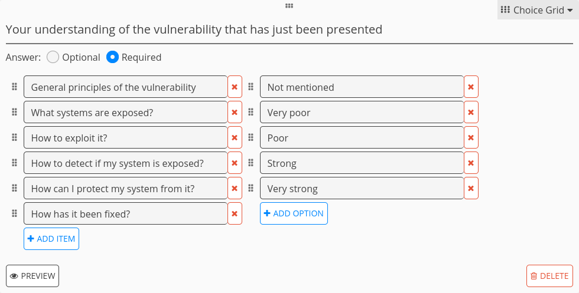
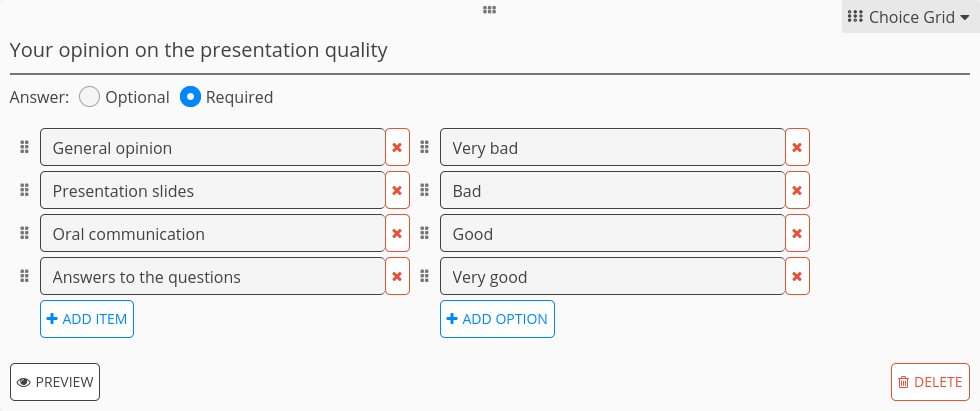
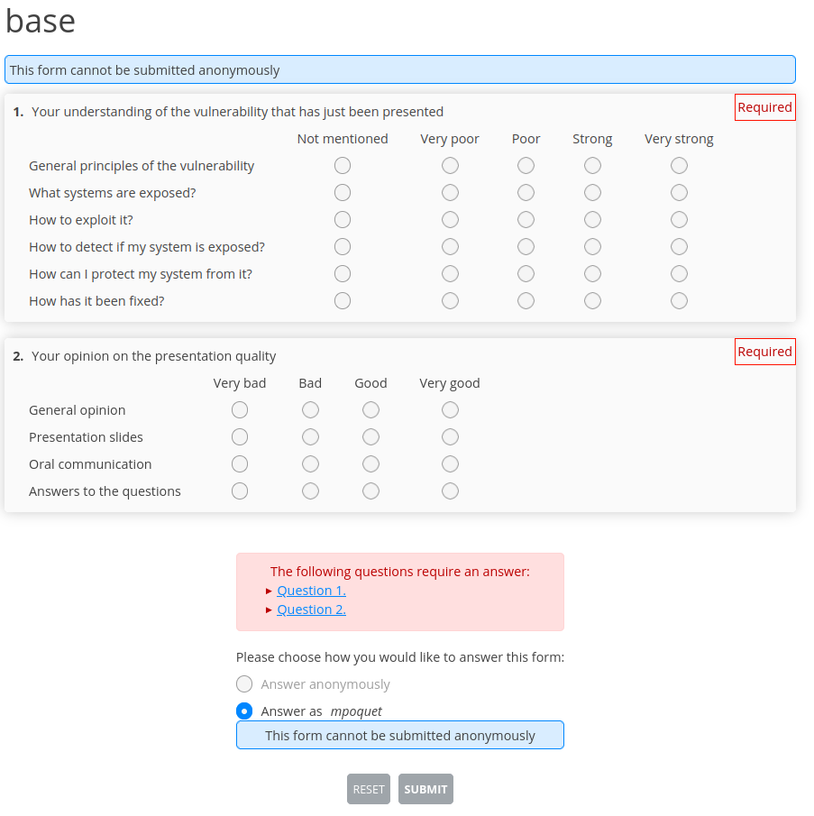
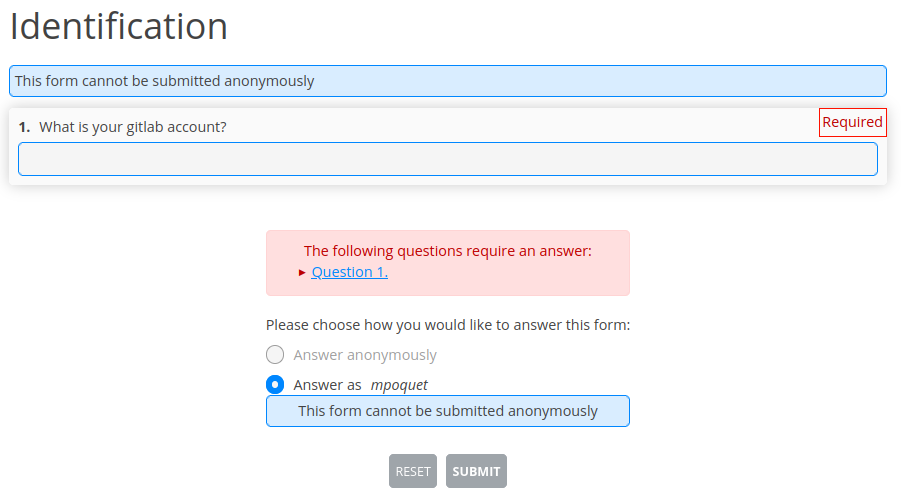
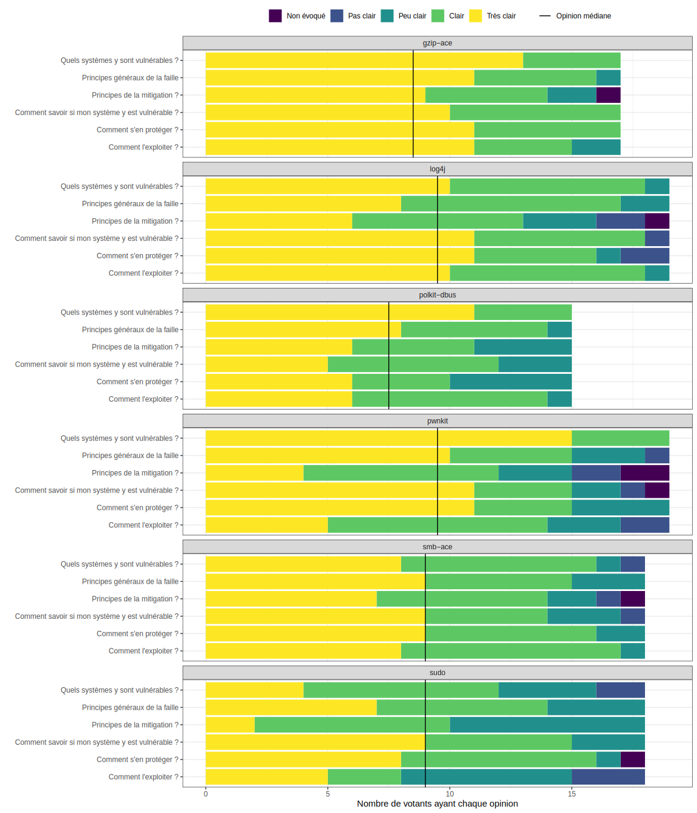
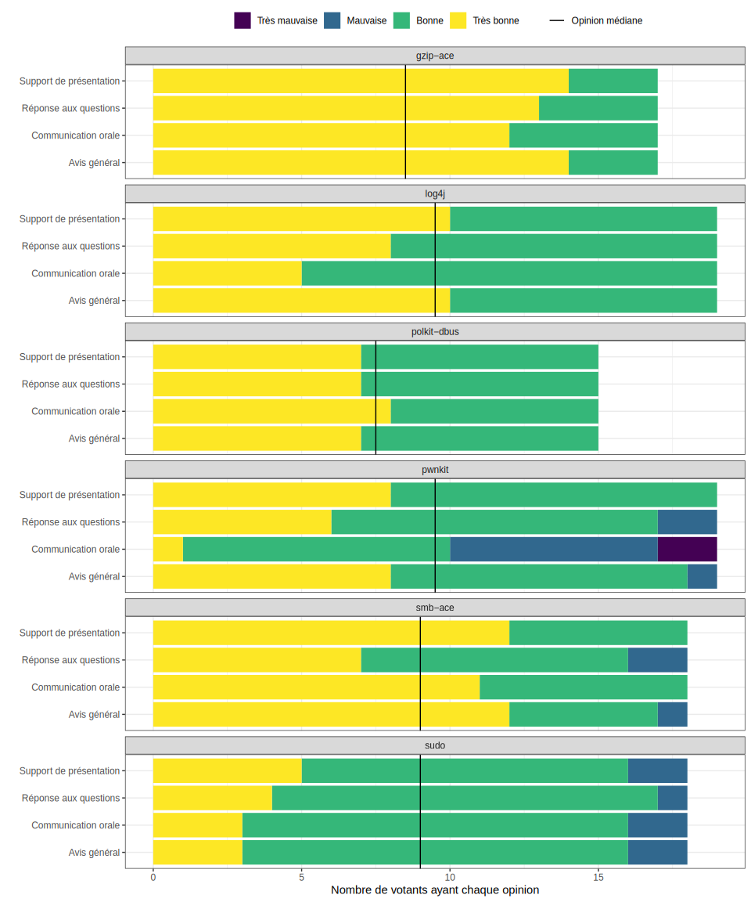

Student inter-evaluation with R and cryptpad
============================================

I just gave a software vulnerability course where I made the students work in groups on a CVE_ (understand how it works, how to exploit it, how to reproduce the exploit, how it has been fixed, how to know if a system is exposed, how to fix an exposed system...).
The students presented their work to the other groups and I wanted to experiment on the evaluation of the presentation.
Instead of just giving a grade based on my opinion,
I wanted to gather the opinion of all the students in the audience and to somehow agregate their opinions into a grade.

While the questionnaire I did to gather the students' opinion was a bit naive and not very interesting, the tools I used to do this can be interesting if one wants to try something similar so I share it here.

Tools used
----------

- I used CryptPad_ to create questionnaires that students can fill to evaluate the work of other students.
  CryptPad is an open-source (AGPL-3.0) web-based office suite.
  In particular, CryptPad's Form tool enables to create questionnaires that can be completed by people, and you can very easily obtain exploitable CSV_ data once it has been completed.
- I used R_ + tidyverse_ to manipulate data, to grade students and to visualize results.

Base questionnaire
------------------

First, I created a **base** questionnaire used to evaluate a presentation.

- I wanted students to self-evaluate their understanding of a vulnerability just after it has been presented.
- I wanted students to evaluate the quality of the presentation itself.
- I used ordinal scales with special values to detect whether something important was missing in a group's presentation.

I used CryptPad's ``Choice Grid`` to make this convenient.
Here are screenshots of the interface that enables to create polls.

  Question to let students self-evaluate their understanding of the vulnerability.

  Question to let students inter-evaluate the quality of the presentation.

And here is the interface used to fill the questionnaire.

  Interface to fill the questionnaire (used by students (and teacher))

I then created a copy of the base file for each group.
This can be done from CryptPad's Drive interface (Drag and drop or Right Click + Make a copy).

Identification questionnaire
----------------------------

Data gathered from CryptPad are identified by CryptPad user name.
I created a questionnaire to associate this user name with the student identifier that I used for other tests (their GitLab account on the university's GitLab instance).

Workflow
--------

Presentations were done in sequence during the same course time slot.
I made the students fill the identification questionnaire at the beginning of the time slot (before the presentations).
I saved the gathered data on my disk by clicking on the ``Export to csv`` button on the Poll's ``Responses`` tab.

I then asked the audience of each presentation to pre-fill the questionnaire during the presentation, and to complete it just after the end of the presentation (I gave them a bunch of minutes).
I saved the gathered data of each presentation once all the students have filled the questionnaire.

List of involved data files
---------------------------

Here are the various data files involved in this analysis.

.. literalinclude:: identification.csv
   :language: csv
   :caption: :download:`identification.csv <identification.csv>`, obtained from the `Identification questionnaire`_.

.. literalinclude:: cve-pwnkit.csv
   :language: csv
   :caption: An evaluation file for each group, here :download:`cve-pwnkit.csv <cve-pwnkit.csv>` for the group that presented PwnKit_. Obtained from each questionnaire duplicated from the `Base questionnaire`_.

.. literalinclude:: group-members.csv
   :language: csv
   :caption: :download:`group-members.csv <group-members.csv>` associates students to groups (+teacher for convenience's sake). Manually written.

Analysis with R
---------------

Here is the code I used to analyze the data from all the presentations.

The script starts by importing tidyverse_, then creates types to represent the ordinal scales.

.. literalinclude:: analysis.R
   :language: r
   :caption: :download:`analysis.R <analysis.R>`
   :lines: 1-8

Evaluation files for each groups are read separately, then put in a single dataframe.
I used `readr::spec`_ to generate a basic ``cols`` specification.

.. literalinclude:: analysis.R
   :language: r
   :caption: :download:`analysis.R <analysis.R>`
   :lines: 10-32

Columns names are very long in the evaluation CSV files so I shortened them.

.. literalinclude:: analysis.R
   :language: r
   :caption: :download:`analysis.R <analysis.R>`
   :lines: 34-46

Participants in the evaluation are then identified, which enables to filter wrong data.
In my real data, some students evaluated their own group and I wanted to exclude this from my analysis.

.. literalinclude:: analysis.R
   :language: r
   :caption: :download:`analysis.R <analysis.R>`
   :lines: 48-63

In my real evaluation, all groups did not have the same size.
I planned to use the median opinion to grade students, so I computed how many participants were involved in the evaluation of each group to visualize the median opinion line.

.. literalinclude:: analysis.R
   :language: r
   :caption: :download:`analysis.R <analysis.R>`
   :lines: 65-72

Here is a visualization script of the self-assessment of the participants understanding, for each group presentation.
I used `tidyr::pivot_longer`_ to make the data in the format expected for stacked bar charts.

.. literalinclude:: analysis.R
   :language: r
   :caption: :download:`analysis.R <analysis.R>`
   :lines: 74-89

Here is a very similar visualization script for the inter-evaluation of the quality of each group presentation.

.. literalinclude:: analysis.R
   :language: r
   :caption: :download:`analysis.R <analysis.R>`
   :lines: 91-107

On my real data, this is how the visualizations looked like (Text/values are in French).

  Visualization of the self-assessment understanting data.

  Visualization of the inter-evaluation quality data.

I originaly planned to use the median value to grade the students (thanks to `missMethods::median`_), but the students greatly overestimated the quality of the presentation in my opinion so I used an average instead.
To do so I used `dplyr::mutate`_ with `dplyr::recode`_ to associate a numeric value to each ordinal value, then just used an average on the *General opinion* values to grade the whole presentation.

.. literalinclude:: analysis.R
   :language: r
   :caption: :download:`analysis.R <analysis.R>`
   :lines: 109-119

A much more complex grading function can of course be used, for example by:

- Using more data than the *General opinion* values.
- Using a weighted average by giving a weight to each Participant.
  For example giving a stronger weight to the teacher can make sense.
  The weight of the students can be the same for all students or depend on some value, for example on the grade of another test meant to evaluate their expertise level.

.. _CVE: https://en.wikipedia.org/wiki/Common_Vulnerabilities_and_Exposures
.. _R: https://en.wikipedia.org/wiki/R_(programming_language)
.. _tidyverse: https://www.tidyverse.org/
.. _CryptPad: https://cryptpad.fr/
.. _CSV: https://en.wikipedia.org/wiki/Comma-separated_values
.. _PwnKit: https://blog.qualys.com/vulnerabilities-threat-research/2022/01/25/pwnkit-local-privilege-escalation-vulnerability-discovered-in-polkits-pkexec-cve-2021-4034
.. _`readr::spec`: https://readr.tidyverse.org/reference/spec.html
.. _`tidyr::pivot_longer`: https://tidyr.tidyverse.org/reference/pivot_longer.html
.. _`missMethods::median`: https://search.r-project.org/CRAN/refmans/missMethods/html/median.factor.html
.. _`dplyr::mutate`: https://dplyr.tidyverse.org/reference/mutate.html
.. _`dplyr::recode`: https://dplyr.tidyverse.org/reference/recode.html
