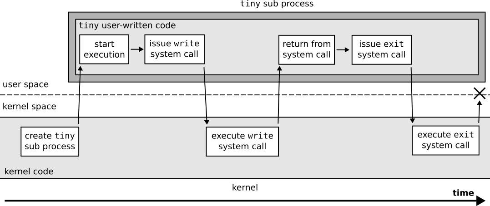
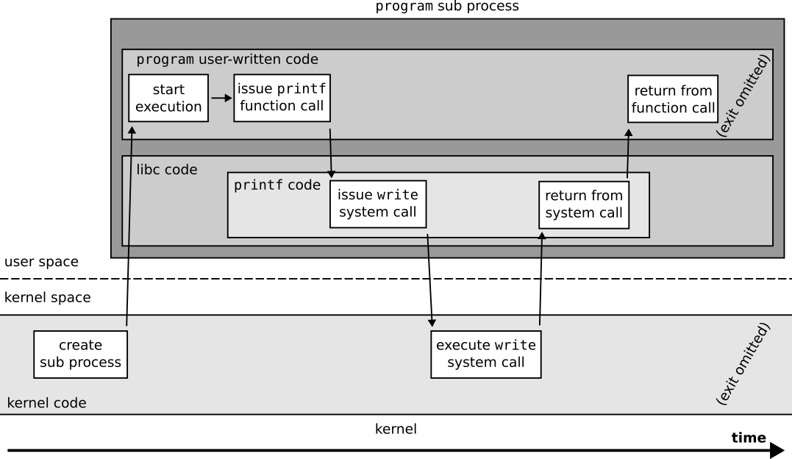
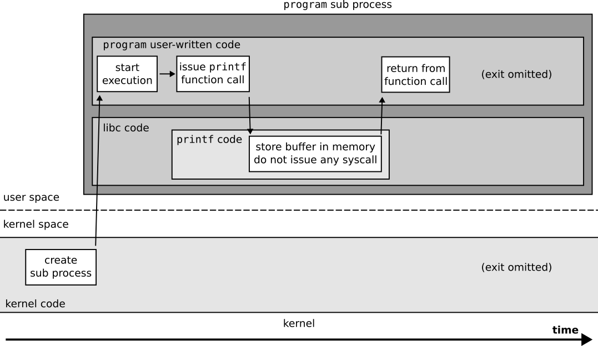
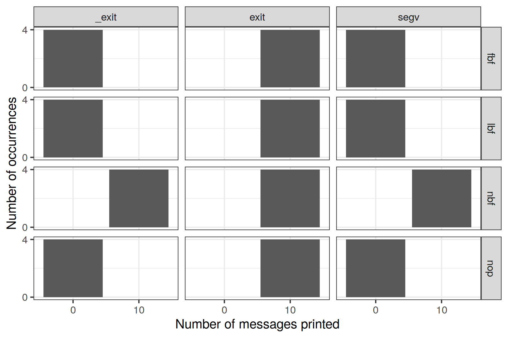
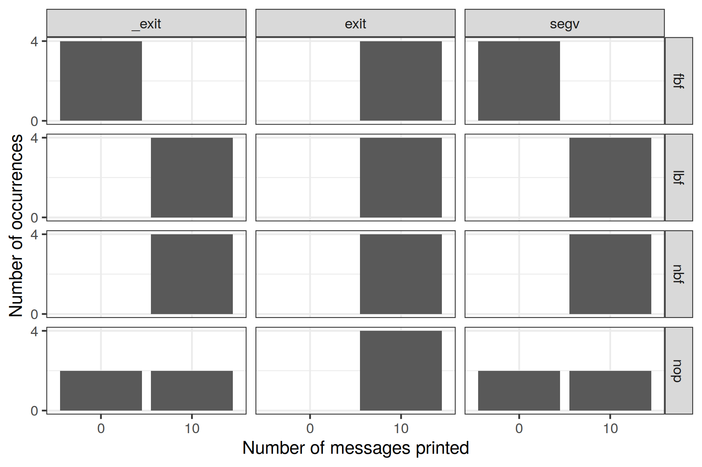
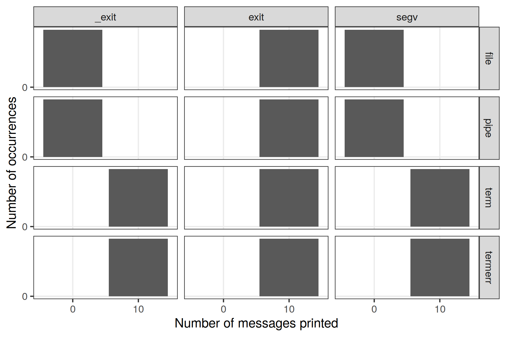

``printf`` and parallel code debugging
======================================

I recently spent a lot of time reviewing the code of students that learn how to develop parallel programs in C.
These programs are often buggy, and some students rely on ``printf`` to *see* what happens in their parallel code.
However, the messages obtained this way are misleading in many cases, as what is printed may not representative of what has been executed on the machine.
This post explains why and gives tips to make *quick&dirty* debugging with ``printf`` great again if you insist in not using a debugger (or if you don't have debuggers on your university's computers 😅).

Misleading ``printf`` calls example
-----------------------------------
The toy program we will play with today is timidly named ``program`` and has the following features.

- Process parallelism: The program spawns a finite small number of processes. Here, 10 processes are created by the initial process (the initial process prints nothing unless a system error has occurred).
- Action determinism: Unless a system error occurs (*e.g.*, cannot create a process), the program will always issue the exact same actions. Here the actions are independent: Each process simply prints its number (from 0 to 9) as a single ``printf`` call.
- Action order non-determinism: No guarantee on the order of the parallel actions.

.. literalinclude:: program.c
   :language: C
   :caption: pseudo C code that represents ``program``

Each execution of the program therefore calls ``printf`` the same number of times, and the content of the messages is the same. Only the order of the printed messages should change.

Here are two consistent executions of the program executed directly from my terminal by calling ``./program``. The environment I used is composed of kitty_ 0.26.2, zsh_ 5.9, NixOS_ 22.05, Linux_ 5.15.72, glibc_ 2.34.

- ``0123456789``: All 10 messages are printed in *classical* order.
- ``0341256789``: All 10 messages are printed but in another order.

If you repeat the execution of the program, you'll very often see a display of inconsistent messages.

- ``102346578``: ``printf("9")`` was executed but its message was lost.
- ``012345679``: ``printf("8")`` was executed but its message was lost.

Now let us say that you want to automate the counting of the number of bytes written by the program.
This can be done by piping the result of the program to ``wc``, for example ``./program | wc --bytes``.
If you do so, you always get this result.

- ``0``

So, to wrap things up...

- You are sure that your program always executes ``printf`` 10 times.
- When you run it directly in your terminal, it is common that some messages are *lost*, that is to say not printed on your terminal.
- When you pipe the output of your program to another program, all messages are *lost*...

What ``program`` does from a system perspective
-----------------------------------------------

From a system perspective, ``program`` should be very simple.
Most of its code should consist in communicating with the operating system, which is done via `syscalls`_.
Syscalls (or system calls) are the main mechanism to enable user space processes to communicate with the kernel.
From the user process point of view, a syscall can be seen as a synchronous function call: The user process issues a syscall with some data, then waits for the *function* to return, then reads what the *function* has returned.
The main difference with an usual function call is that the function code is not in user space (contrary to a C library that would have been loaded at the program startup time) but in the kernel itself. Code in kernel space is executed with higher privileges. The exact mechanism used to issue a syscall depends on the combination of your CPU architecture and your operating system, but the underlying mechanism mostly relies on interrupts_. Interested readers can refer to `how to issue a linux syscall depending on your architecture`_.

Here are the important linux syscalls that we can expect ``program`` to issue.

- The initial process should issue a syscall to spawn each *sub* process. Many syscalls can be used for this purpose such as ``fork`` or a ``clone`` variant.
- Each *sub* process should issue a syscall to tell the operating system that a message should be printed on the process standard output. This is typically done via a ``write`` syscall.
- All processes (the initial process and the 10 sub processes) should issue an ``exit`` syscall to end their execution.

To check whether ``program`` has the same behavior as the one we just described, we can create a new tiny software that exactly issues these syscalls, then check if the execution of ``tiny`` and ``program`` are similar.
To make sure ``tiny`` is not bundled with any magical code at loading or exiting time, let us write it without C library.
System calls are actually quite simple to do in x86-64 assembly so let us write ``tiny`` in assembly 🙂.
Various resources can be useful to do this, such as section A.2 "AMD64 Linux Kernel Conventions" of `System V ABI AMD64 Architecture Processor Supplement`_, or a `list of linux syscalls for x86-64 with their codes and parameters`_.

   Figuration of the system calls issued by a ``tiny`` sub process over time.

.. literalinclude:: tiny.S
   :language: asm
   :caption: x86-64 assembly implementation of ``tiny``: :download:`tiny.S <tiny.S>`

If you are running on x86-64, ``tiny`` can be compiled with this command: ``gcc -c tiny.S && ld -o tiny tiny.o``.
When we execute ``tiny`` directly in our terminal, it always prints the 10 expected messages.
And when it is piped to ``wc`` via ``./tiny | wc --bytes``, it always prints that 10 characters have been generated...
**We can therefore see that** ``tiny`` **prints messages consistently, while** ``program`` **does not!**

This version of ``tiny`` is not perfect though.
First, it does not handle the errors from syscalls at all (``fork`` returning ``-1`` is not checked, ``write`` returning ``0`` or ``-1`` is not checked).
Another problem is that the initial process can ``exit`` before some of its children have issued their ``write`` syscall.
This can lead to some misleading prints when ``tiny`` is automatically executed many times in a row.

.. code-block::
   :caption: Misleading prints from two consecutives calls to ``tiny`` from ``for i in {1..100} ; do ./tiny && echo ; done``.

   012356478   # initial process finished and echo printed its newline before the write of 9 has been done
   90123456897 # the write of 9 is not lost though, it appears on one of the next lines

This last problem can be fixed by forcing the initial process to wait for the termination of its child processes, for example by calling the ``wait4`` syscall until it returns ``-1``. This is exactly what ``tiny-wait`` does, whose code difference over ``tiny.S`` is highlighted below.
This new version (``tiny-wait``, that can be compiled with ``gcc -c tiny-wait.S && ld -o tiny-wait tiny-wait.o``) always prints consistent messages, even when its execution is automated in sequence.

.. literalinclude:: tiny-wait.S
   :language: asm
   :diff: tiny.S
   :caption: diff of :download:`tiny-wait.S <tiny-wait.S>` over :download:`tiny.S <tiny.S>`

So, what is the difference between ``program`` and ``tiny`` or ``tiny-small`` in terms of syscalls?
We can use a tool to trace the syscalls done by a process to observe what ``program`` does.
strace_ is the standard tool to do such tracings.
Calling ``strace -ff --output=out ./program`` enables to trace the system calls done by the process spawned by executing ``./program``, while also tracing all the subprocesses that ``program`` spawns — and logs will be separated in one file per process. Let us say that we could trace an execution that led to inconsistent prints: ``120345679`` was printed so the ``8`` message was lost. Here are the traces of the sub processes in charge of printing ``8`` and ``9``.

.. literalinclude:: out.8
   :emphasize-lines: 6
   :caption: Trace of the process that executed ``printf("8")``.

.. literalinclude:: out.9
   :emphasize-lines: 6,7
   :caption: Trace of the process that executed ``printf("9")``.

**Conclusion: The faulty process exited without calling** ``write`` **at all!**
The operating system works as expected, but something fishy happens in the process that runs ``program``...

Buffering in libc's ``stdio``
-----------------------------

Let us look at what happens inside a ``program`` sub process during its execution.

   Figuration of the system calls done by a ``program`` sub process that ``write`` messages.

We can see that ``program`` sub processes that write messages have a behavior very similar to ``tiny``'s.
The main difference is that the code of the user process is not fully defined by user-written code,
but that some code such as ``printf`` is defined in the C standard library instead.
glibc's ``printf`` code is quite complex and does not call ``write`` directly.
I do not give details on the various functions that glibc's ``printf`` calls in this post, but interested readers can refer to an `hello world analysis`_ for this purpose.
Now let us see what happens for ``program`` sub processes that do not ``write`` messages.

   Figuration of the system calls done by a ``program`` sub process that **does not** ``write`` messages.

**The source of our message loss is user space buffering from libc!**
``man stdio`` indeed indicates that "The standard I/O library provides a simple and efficient **buffered** stream I/O interface".
``man setvbuf`` contains valuable information on the available buffering modes, and defines the default buffering mode of ``stdout`` and ``stderr`` streams.

.. code-block:: text
   :caption: Introduction from ``man setvbuf``.

   The three  types  of  buffering  available  are  unbuffered,  block
   buffered,  and line buffered.  When an output stream is unbuffered,
   information appears on the destination file or terminal as soon  as
   written;  when  it  is block buffered, many characters are saved up
   and written as a block; when it is line  buffered,  characters  are
   saved up until a newline is output or input is read from any stream
   attached to a terminal  device  (typically  stdin).   The  function
   fflush  may  be  used  to  force  the  block  out  early.   (See
   fclose.)

   Normally all files are block buffered.  If a  stream  refers  to  a
   terminal (as stdout normally does), it is line buffered.  The stan‐
   dard error stream stderr is always unbuffered by default.

In addition to this, ``man exit`` indicates that "all open stdio streams are flushed and closed" when the ``exit`` function from libc is called.

.. warning::

   The ``exit`` function from the C standard library should not be confused with the ``exit`` linux syscall.

   In fact, most linux syscalls are wrapped in function in the C standard library, but these functions can contain user space code that is executed before of after the system call. The libc functions can furthermore decide to use another system call than the one they are named after, for example as of glibc 2.34 the ``fork`` glibc function will prefer using a ``clone`` syscall variant rather than a ``fork`` syscall.

A small experiment
------------------

Previous section showed that many parameters are important regarding the loss of messages in ``stdio`` buffers.

- What is behind the standard output of the process?
- How does the process terminate?
- Have the buffering mode of ``stdio`` streams been explicitly set by the process?
- Does the process calls ``fflush`` after calling ``printf``?

I propose to define, build and run many variants of ``program`` to clarify when messages are lost in ``stdio`` buffers.
All the files involved in this experiment are available on `this experiment's gist`_.
The skeleton that generates the variants is shown below.
It contains the ``INIT``, ``PRINT``, ``EXIT`` and ``FIN`` macros whose definition depend on the exact variant that is built.

.. literalinclude:: experiment/base.c
   :lines: 50,54-69
   :caption: Main skeleton to generate ``program`` variants.

Here are the tested variants for ``INIT``.

- ``nop``: do nothing.
- ``nbf``: explicitly disable ``stdout`` buffering.
- ``lbf``: explicitly set ``stdout`` as line buffered, using a buffer of size 1024 bytes.
- ``fbf``: explicitly set ``stdout`` as fully buffered, using a buffer of size 1024 bytes.

Here are the tested variants for ``PRINT``.

- ``nop``: do nothing.
- ``p``: call ``printf`` on ``i`` (without newline).
- ``pf``: call ``printf`` on ``i`` (without newline) then call ``fflush``.
- ``pn``: call ``printf`` on ``i\n``.
- ``pnf``: call ``printf`` on ``i\n`` then call ``fflush``.
- ``w``: call the ``write`` libc function on ``i`` (without newline).
- ``wn``: call the ``write`` libc function on ``i\n``.

Here are the tested variants for ``EXIT``.

- ``exit``: call ``exit(0)`` (*clean* termination).
- ``_exit``: call ``_exit(0)`` (*rough* termination: should not flush ``stdio`` streams).
- ``segv``: issues a segmentation fault (what student code will do in practice 😝).

And finally here are the variants for ``FIN``.

- ``wait``: call the ``wait`` libc function until all sub processes have terminated.
  Not waiting for the termination of subprocesses is not tested here because it makes the automation of the execution too painful.

You can use the following files if you want to build and run some of these variants yourself.

- :download:`base.c <experiment/base.c>` is the full skeleton code
- :download:`build.ninja <experiment/build.ninja>` defines how to build the variants
- :download:`generate.py <experiment/generate.py>` generates the ninja file

I furthermore propose to execute the processes in several contexts to see how this changes their behavior.

- ``term``: call ``./variant`` with standard output set to a terminal.
- ``termerr``: call ``./variant 1>&2`` with standard output and error set to a terminal.
- ``file``: call ``./variant > some_file``.
- ``pipe``: call ``./variant | wc --bytes``.

I have executed each variant combination 100 times on a machine of `Grid'5000`_'s cluster Dahu_.
For each execution context, I used tmux_ to log what has been printed on my terminal to a file (by calling tmux commands ``capture-pane -S -`` then ``save-buffer <FILENAME>``).

Experiment results
------------------

The raw traces and usable data files resulting from the execution of all the variants are available on `this experiment's gist`_.
A first result of this experiment is that the buffering behavior of ``glibc`` 2.34 seems deterministic.
For all 336 combinations, there was no variance in the number of messages printed.
In other words, all 100 executions of each variant either printed 10 messages or 0.
To go deeper down the rabbit hole, here is the overall distribution of the messages printed depending on the values of ``PRINT`` and execution context.

   Distribution of the number of messages printed for each variant, depending on how the messages are printed (columns) and on the execution context (rows).

We can already conclude for some ``PRINT`` strategies.

- Not calling any printing function (``nop`` column) never prints any message. Yay! 😅
- Calling the libc ``write`` function never loses messages, regardless if the buffer is terminated by a newline (``wn`` column) or not (``w`` column). 🥳💪
- Calling ``fflush(stdout);`` after a ``printf`` function never loses messages, regardless if the buffer is terminated by a newline (``pnf`` column) or not (``pf`` column). 🥳💪
- Just calling ``printf`` with a buffer not terminated by a newline (``p`` column) leads to message loss in some cases.
- Contrary to popular belief, just calling ``printf`` with a buffer terminated by a newline (``pn`` column) also leads to message loss in some cases. 😱

Let us investigate what happens for the non-trivial variants! First, let us zoom on what happens when just calling ``printf`` without newline (``p`` ``PRINT`` variant).

   Distribution of the number of messages printed for the print variant where ``printf`` is just called **without a newline** in its buffer. Various combinations exist depending on other parameters and are displayed depending on how the process has set its buffering policy (rows) and how it has terminated (columns).

This figure is enough to conclude about just calling ``printf`` without newline at the end of the buffer!

- If the process terminates by calling the libc ``exit`` function, it never loses messages. This is consistent with ``man exit``, which states that the function should flush all buffers.
- If the process disables buffering on its standard output (*i.e.*, sets ``stdout`` to the unbuffered buffering mode), it never loses messages. This is consistent with ``man setvbuf`` that states that "When an output stream is unbuffered, information appears on the destination file or terminal as soon as written".
- In all other cases, the messages are always lost. This is consistent with ``man setvbuf`` as the message does not contain a newline for the line buffered policy, and as the message is too small to reach the block size for the block buffered policy.

Let us now finally investigate the last print case: Just calling ``printf`` with a buffer terminated by a newline.

   Distribution of the number of messages printed for the print variant where ``printf`` is just called **with a newline** in its buffer. Various combinations exist depending on other parameters and are displayed depending on how the process has set its buffering policy (rows) and how it has terminated (columns).

Let us first focus on the cases where the buffering policy is fully defined — all rows but the last one ``nop``.

- As expected, if the process terminates by calling the libc ``exit`` function, it never loses messages.
- Messages are never lost if the buffering policy is set to unbuffered (disabled) or line buffered.
  This is consistent with ``man setvbuf`` that states "when it is line buffered, characters are saved up until a newline is output or input is read from any stream attached to a terminal device (typically stdin)".
- As expected, if the file is fully buffered, all messages are lost unless the ``exit`` libc function has been called.
  This is because the buffer we wrote is too small to reach the block size we have set.

Finally, we can see that if we do not explicitly set the buffering policy of ``stdout`` in our program, messages may be lost or not.
This is because the tested execution contexts here do not have the same default buffering mode, as shown on the next figure.
Files and pipes are block buffered by default, while the terminal is line buffered by default.

   Distribution of the number of messages printed for the print variant where ``printf`` is just called **with a newline** in its buffer, and when the default buffering policy is used. Data is shown depending on the context the process has been executed in (rows) and how it has terminated (columns).

Take home tips to prevent ``printf`` message loss
-------------------------------------------------

We have seen that simply calling ``printf`` in a multiprocess program can easily lead to the loss of messages, which can be very painful if one wants to use such messages to debug one's program. When all processes terminate cleanly by calling the ``exit`` function or similar (*e.g.*, by returning from the ``main`` function), no messages are lost. In other cases, typically when at least one process crashes or deadlocks, messages can be lost unless:

- You ensured that all ``printf`` message were followed by a call to ``fflush(stdout);``.
- You ensured that buffering on ``stdout`` has been disabled by calling ``setvbuf(stdout, NULL, _IONBF, 0);``.

If you have additional properties on the messages sent to ``printf`` (*e.g.*, that they are finished by a newline or that they are big enough), other ``stdio`` buffering policies may prevent message loss — but doing such a strong assumption on students' code is not reasonable IMHO.

Finally, another solution could be to force the use of ``stderr`` rather than ``stdout``, as ``stderr`` is unbuffered by default.
However this change is not trivial to do: As seen on the experiment done in this post, redirecting the file descriptors of the process before calling it does not help in any way. We could rewrite ``printf`` calls to ``fprintf`` on ``stderr`` with a macro such as ``#define printf(args...) fprintf(stderr, ##args)``, but I think that simply adding an ``setvbuf(stdout, NULL, _IONBF, 0);`` instruction at the beginning of the ``main`` function of a student code that has inconsistent prints would be more convenient and much more reliable.

.. _kitty: https://github.com/kovidgoyal/kitty
.. _zsh: https://en.wikipedia.org/wiki/Z_shell
.. _NixOS: https://nixos.org/
.. _Linux: https://www.kernel.org/
.. _glibc: https://www.gnu.org/software/libc/
.. _syscalls: https://en.wikipedia.org/wiki/System_call
.. _interrupts: https://en.wikipedia.org/wiki/Interrupt
.. _`how to issue a linux syscall depending on your architecture`: https://www.cs.uaf.edu/2017/fall/cs301/lecture/11_17_syscall.html
.. _`System V ABI AMD64 Architecture Processor Supplement`: https://refspecs.linuxfoundation.org/elf/x86_64-abi-0.99.pdf
.. _`list of linux syscalls for x86-64 with their codes and parameters`: https://filippo.io/linux-syscall-table/
.. _`hello world analysis`: http://osteras.info/personal/2013/10/11/hello-world-analysis.html
.. _strace: https://en.wikipedia.org/wiki/Strace
.. _Grid'5000: https://www.grid5000.fr/
.. _Dahu: https://www.grid5000.fr/w/Grenoble:Hardware#dahu
.. _tmux: https://en.wikipedia.org/wiki/Tmux
.. _`this experiment's gist`: https://gist.github.com/mpoquet/197ba306f7207b171d90cddf2b94fa0a
